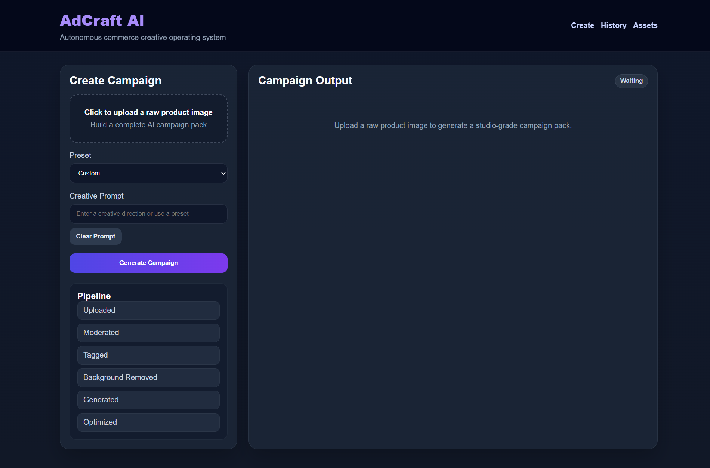
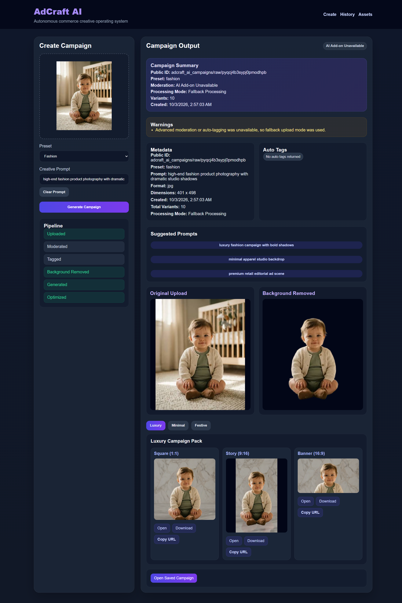
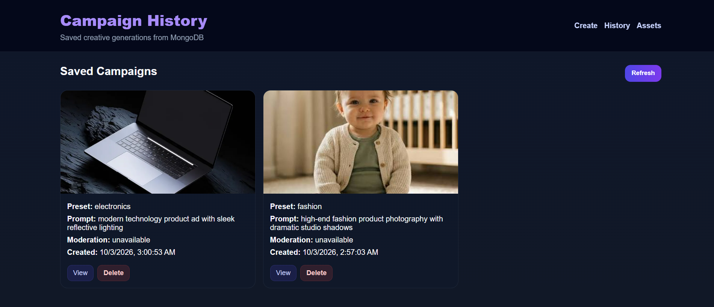
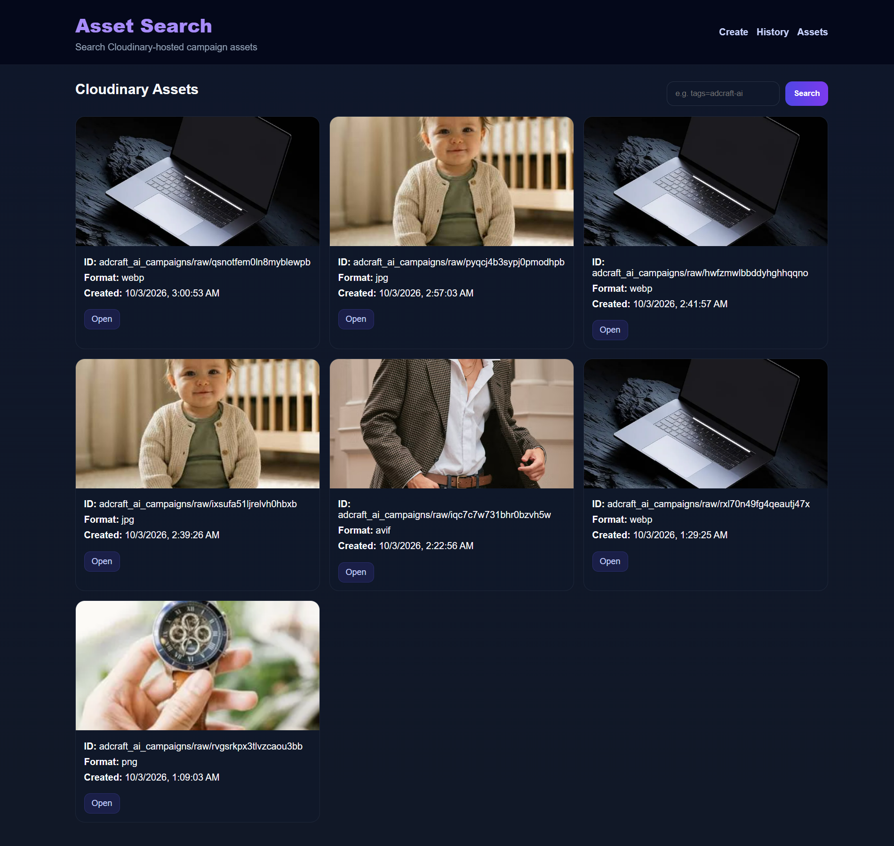

# pixels-to-products-cloudinary-ai-hackathon-2026-sudarshan-chakra

# AdCraft AI

### Autonomous Commerce Creative Operating System

**AdCraft AI** is an autonomous AI media pipeline for commerce
creatives, built for the **Pixels to Products -- Cloudinary AI Hackathon
2026**.

It helps D2C brands, e-commerce sellers, marketplace businesses, and
creators transform raw product photos into **campaign-ready, optimized,
searchable, and reusable ad assets** using **Cloudinary AI, Node.js,
Express.js, and MongoDB**.

Instead of manually editing, resizing, organizing, and delivering the
same product image across multiple platforms, AdCraft AI automates the
complete workflow:

**Upload → Analyze → Transform → Generate → Optimize → Store → Search →
Reuse**

------------------------------------------------------------------------

## 👨‍💻 TEAM

**Sudarshan Chakra**

------------------------------------------------------------------------

## 🎯 Problem Statement

Small businesses, D2C brands, e-commerce sellers, marketplace sellers,
creators, and local businesses often start with simple smartphone
product photos.

These images are frequently not ready for advertising because they may
contain:

-   distracting or cluttered backgrounds
-   inconsistent presentation
-   no platform-specific formats
-   limited metadata and organization
-   no moderation workflow
-   no reusable campaign history

Creating professional advertising creatives manually requires multiple
tools, repeated editing, resizing, optimization, and asset management.

### The problem

**How can one raw product image be converted into a complete
campaign-ready media pack without requiring a designer to manually
process every variation?**

------------------------------------------------------------------------

## 💡 Solution

AdCraft AI acts like an **AI ad-agency in a box**.

A user uploads one raw product image, and the platform automatically:

1.  uploads the media to Cloudinary
2.  attempts AI moderation
3.  attempts AI auto-tagging
4.  enriches asset metadata
5.  removes the original background
6.  builds multiple creative directions
7.  generates Luxury, Minimal, and Festive themes
8.  creates Square, Story, and Banner variants
9.  optimizes delivery using `f_auto` and `q_auto`
10. stores campaign history in MongoDB
11. generates prompt suggestions from returned tags
12. makes campaigns and assets searchable and reusable

The result is a complete **AI-powered commerce creative pipeline**,
rather than a simple image transformation tool.

------------------------------------------------------------------------

## 🚀 Why AdCraft AI?

A conventional image-generation workflow may look like:

``` text
Prompt → Image
```

AdCraft AI is designed as a complete media workflow:

``` text
Raw Product Image
       ↓
Cloudinary Ingestion
       ↓
Moderation + AI Tagging
       ↓
Metadata Enrichment
       ↓
Background Removal
       ↓
Creative Theme Generation
       ↓
Responsive Format Generation
       ↓
Delivery Optimization
       ↓
MongoDB Campaign Storage
       ↓
Search + History + Reuse
```

This makes the project a practical example of **AI media pipeline
automation**.

------------------------------------------------------------------------

# ✨ Core Features

## ☁️ 1. Cloudinary Media Ingestion

-   Cloudinary Upload API integration
-   Structured folder organization
-   Asset tagging
-   Metadata/context support
-   Cloudinary-hosted media
-   Fallback to basic upload when optional AI functionality is
    unavailable

------------------------------------------------------------------------

## 🛡️ 2. AI Moderation

When supported by the Cloudinary account, the system attempts to
moderate uploaded media before continuing the campaign pipeline.

Possible states include:

-   `approved`
-   `pending`
-   `rejected`
-   `unavailable`

If an image is rejected, the campaign processing stops.

If moderation is unavailable, the application continues using fallback
handling and surfaces the appropriate warning.

------------------------------------------------------------------------

## 🧠 3. AI Auto-Tagging

Cloudinary can attempt to identify useful labels from uploaded media.

Example tags may include:

-   bottle
-   skincare
-   watch
-   shoe
-   jewelry
-   electronics
-   cosmetics
-   fashion

Returned tags can be used for:

-   metadata display
-   asset organization
-   search
-   prompt recommendations
-   campaign intelligence

------------------------------------------------------------------------

## ✂️ 4. Background Removal

The pipeline attempts to create a clean product cutout.

This is particularly useful for raw seller photos containing:

-   room backgrounds
-   tables
-   desks
-   clutter
-   distracting objects

If background removal is unavailable, the original image is retained as
a fallback.

------------------------------------------------------------------------

# 🎨 Campaign Creative Engine

For every uploaded product image, AdCraft AI generates three creative
directions.

## 💎 Luxury Theme

A premium and elegant commercial presentation designed for high-end
product positioning.

## ◻️ Minimal Theme

A clean, simple ecommerce-oriented presentation with a studio-style
visual direction.

## 🎉 Festive Theme

A vibrant promotional direction suitable for seasonal campaigns, special
events, and promotional launches.

------------------------------------------------------------------------

## 📐 Responsive Creative Variants

Every theme is generated in three delivery formats:

  Format         Aspect Ratio Typical Use
  ------------ -------------- ---------------------------------
  **Square**              1:1 Feed posts / social commerce
  **Story**              9:16 Stories / Reels
  **Banner**             16:9 Website banners / hero sections

Therefore:

``` text
3 Themes × 3 Formats = 9 Creative Variants
```

Plus the background-removed product version.

So a single upload can produce **10 useful campaign outputs**.

------------------------------------------------------------------------

# 🔄 Full Automation Workflow

## Step 1: User Uploads a Product Image

The user opens the create page and uploads a raw product image.

Supported examples include:

-   skincare
-   cosmetics
-   watches
-   shoes
-   jewelry
-   electronics
-   packaged food
-   fashion accessories
-   consumer products

The user can also:

-   select a preset
-   enter a custom creative prompt

------------------------------------------------------------------------

## Step 2: Backend Receives the File

The backend uses **Multer** with in-memory storage.

The uploaded image is converted into a base64 data URI and passed to
Cloudinary.

------------------------------------------------------------------------

## Step 3: Cloudinary Upload Automation

The upload service attempts to perform:

-   Cloudinary storage
-   moderation
-   auto-tagging
-   folder organization
-   tags
-   metadata/context enrichment

If optional AI capabilities are unavailable, the application falls back
to a standard upload path.

------------------------------------------------------------------------

## Step 4: Moderation

If moderation is available, the uploaded image is checked before
campaign processing.

Possible outcomes:

``` text
Approved
Pending
Rejected
Unavailable
```

A rejected image does not continue through the campaign generation
pipeline.

------------------------------------------------------------------------

## Step 5: Auto-Tagging and Metadata Enrichment

The system attempts to retrieve meaningful labels from Cloudinary.

These tags can later support:

-   asset search
-   metadata display
-   prompt suggestions
-   campaign organization

------------------------------------------------------------------------

## Step 6: Prompt Construction

The platform builds a **base creative prompt** from:

-   the selected preset, or
-   a custom user prompt

It then expands the direction into:

``` text
Luxury
Minimal
Festive
```

This creates a one-to-many creative workflow from a single product
source.

------------------------------------------------------------------------

## Step 7: Background Removal

The system attempts to isolate the product from its original background.

The resulting cutout becomes a reusable source for product-focused
creative processing.

If the feature is unavailable, the original image becomes the fallback
source.

------------------------------------------------------------------------

## Step 8: Theme-Based Creative Generation

For each theme, the system generates:

``` text
Square  → 1:1
Story   → 9:16
Banner  → 16:9
```

Where supported, generative background effects can be used.

Otherwise, the application falls back to smart image transformations and
crops.

------------------------------------------------------------------------

## Step 9: Delivery Optimization

Generated Cloudinary URLs use:

``` text
f_auto
q_auto
```

Cloudinary can then automatically select appropriate delivery formats
and quality settings.

This helps improve:

-   loading performance
-   bandwidth efficiency
-   frontend rendering
-   CDN delivery

------------------------------------------------------------------------

## Step 10: Pipeline Tracking

The frontend visually communicates the progress of the automated
workflow:

``` text
Uploaded
   ↓
Moderated
   ↓
Tagged
   ↓
Background Removed
   ↓
Generated
   ↓
Optimized
```

This makes the automation easy to understand during a product demo.

------------------------------------------------------------------------

## Step 11: MongoDB Campaign Persistence

Once processing is completed, the campaign is stored in MongoDB.

Stored information includes:

-   Cloudinary public ID
-   original image URL
-   preset
-   prompt
-   moderation status
-   auto tags
-   warnings
-   pipeline states
-   generated asset URLs
-   format metadata
-   dimensions
-   timestamps

This turns the project into a reusable campaign platform instead of a
one-time generator.

------------------------------------------------------------------------

## Step 12: Prompt Suggestion Automation

Returned tags can be used to generate contextual prompt suggestions.

Examples:

``` text
Beauty / Skincare
→ premium skincare showcase prompts

Jewelry
→ luxury product showcase prompts

Electronics
→ modern technology campaign prompts
```

This reduces the effort required to write creative prompts manually.

------------------------------------------------------------------------

## Step 13: Campaign Detail View

Every saved campaign has a dedicated detail page.

It displays:

-   original uploaded image
-   background-removed image
-   Luxury variants
-   Minimal variants
-   Festive variants

Users can:

-   open an asset
-   download an asset
-   copy the asset URL

------------------------------------------------------------------------

## Step 14: History Dashboard

The `/history` page loads campaigns stored in MongoDB.

Users can:

-   browse previous campaigns
-   review prompts
-   review presets
-   check moderation status
-   reopen campaign details
-   delete campaign records

------------------------------------------------------------------------

## Step 15: Cloudinary Asset Search

The `/assets` page uses the Cloudinary Search API.

Example expressions:

``` text
folder="adcraft_ai_campaigns/raw"
```

``` text
tags=adcraft-ai
```

``` text
tags=preset-beauty
```

This creates a lightweight searchable media library for campaign assets.

------------------------------------------------------------------------

# 🧩 Automation Summary

In simple terms:

``` text
1. Upload raw product image
2. Store it in Cloudinary
3. Attempt moderation
4. Attempt auto-tagging
5. Remove background
6. Build 3 creative themes
7. Generate 3 formats per theme
8. Optimize delivery
9. Save campaign in MongoDB
10. Make assets searchable and reusable
```

The result is a complete AI commerce media pipeline from **one raw
product image**.

------------------------------------------------------------------------

# 🏗️ Architecture Overview

``` text
                         ┌───────────────────┐
                         │   User Upload     │
                         └─────────┬─────────┘
                                   │
                                   ▼
                         ┌───────────────────┐
                         │   Frontend Form   │
                         └─────────┬─────────┘
                                   │
                                   ▼
                         ┌───────────────────┐
                         │  Express Backend  │
                         └─────────┬─────────┘
                                   │
                                   ▼
                    ┌──────────────────────────┐
                    │ Cloudinary Upload API    │
                    └────────────┬─────────────┘
                                 │
             ┌───────────────────┼───────────────────┐
             ▼                   ▼                   ▼
       Moderation           Auto-Tagging       Background
                                                Removal
             │                   │                   │
             └───────────────────┼───────────────────┘
                                 │
                                 ▼
                    ┌──────────────────────────┐
                    │ Creative Theme Engine    │
                    └────────────┬─────────────┘
                                 │
                     ┌───────────┼───────────┐
                     ▼           ▼           ▼
                  Luxury      Minimal     Festive
                     │           │           │
                     └───────────┼───────────┘
                                 ▼
                    ┌──────────────────────────┐
                    │ 1:1 / 9:16 / 16:9       │
                    └────────────┬─────────────┘
                                 │
                                 ▼
                    ┌──────────────────────────┐
                    │ f_auto + q_auto          │
                    │ Optimized Delivery       │
                    └────────────┬─────────────┘
                                 │
                         ┌───────┴────────┐
                         ▼                ▼
                ┌────────────────┐ ┌────────────────┐
                │    MongoDB     │ │ Cloudinary     │
                │ Campaign Data  │ │ Asset Search   │
                └────────────────┘ └────────────────┘
```

------------------------------------------------------------------------

# 🛠️ Tech Stack

## Backend

-   Node.js
-   Express.js
-   MongoDB
-   Mongoose
-   Multer

## Media & AI

-   Cloudinary Upload API
-   Cloudinary Search API
-   Cloudinary AI transformations
-   AI moderation
-   AI auto-tagging
-   Background removal
-   Image transformations
-   Content-aware cropping
-   Optimized delivery

## Frontend

-   HTML5
-   CSS3
-   Vanilla JavaScript

------------------------------------------------------------------------

# 📁 Project Structure

``` text
pixels-to-products-cloudinary-ai-hackathon-2026-sudarshan-chakra/
│
├── server.js
├── package.json
├── .env
│
├── config/
│   ├── db.js
│   └── cloudinary.js
│
├── models/
│   └── Campaign.js
│
├── utils/
│   ├── helpers.js
│   └── promptBuilder.js
│
├── services/
│   └── cloudinaryService.js
│
├── controllers/
│   ├── campaignController.js
│   └── assetController.js
│
├── routes/
│   ├── campaignRoutes.js
│   └── assetRoutes.js
│
└── public/
    ├── index.html
    ├── history.html
    ├── campaign.html
    ├── assets.html
    ├── app.js
    ├── history.js
    ├── campaign.js
    ├── assets.js
    └── style.css
```

------------------------------------------------------------------------

# 🌐 Application Pages

  Route             Purpose
  ----------------- --------------------------
  `/`               Create a new campaign
  `/history`        View saved campaigns
  `/campaign/:id`   View campaign details
  `/assets`         Search Cloudinary assets

------------------------------------------------------------------------

# 🔌 API Reference

## Campaign Routes

### Generate Campaign

``` http
POST /api/campaigns/generate
```

Generates a new campaign from an uploaded product image.

### Get Campaigns

``` http
GET /api/campaigns
```

Returns saved campaigns from MongoDB.

### Get Campaign

``` http
GET /api/campaigns/:id
```

Returns a single saved campaign.

### Delete Campaign

``` http
DELETE /api/campaigns/:id
```

Deletes a campaign record from MongoDB.

## Asset Routes

### Search Assets

``` http
GET /api/assets/search
```

Example:

``` text
/api/assets/search?q=tags=adcraft-ai
```

Searches Cloudinary-hosted media.

------------------------------------------------------------------------

# ⚙️ Environment Variables

Create a `.env` file in the root directory:

``` env
PORT=5000

MONGODB_URI=mongodb://127.0.0.1:27017/adcraft_ai_pro

CLOUDINARY_CLOUD_NAME=your_actual_cloud_name
CLOUDINARY_API_KEY=your_actual_api_key
CLOUDINARY_API_SECRET=your_actual_api_secret
```

> **Security:** Never commit real Cloudinary credentials or a
> secret-filled `.env` file to GitHub.

------------------------------------------------------------------------

# 🚀 Installation

## 1. Clone the repository

``` bash
git clone https://github.com/HackIndiaXYZ/pixels-to-products-cloudinary-ai-hackathon-2026-sudarshan-chakra
```

## 2. Install dependencies

``` bash
npm install
```

## 3. Start MongoDB

For local MongoDB:

``` bash
mongod
```

Or configure `MONGODB_URI` to point to your MongoDB deployment.

## 4. Configure environment variables

Create `.env` and add your MongoDB and Cloudinary credentials.

## 5. Start the server

``` bash
node server.js
```

## 6. Open the application

``` text
http://localhost:5000
```

------------------------------------------------------------------------

# 📖 How to Use

## Create a Campaign

1.  Open the create page.
2.  Upload a raw product image.
3.  Select a preset or enter a custom prompt.
4.  Click **Generate Campaign**.
5.  Wait for the pipeline to complete.
6.  Review the generated variants.
7.  Open the saved campaign detail page.

## View Campaign History

1.  Open `/history`.
2.  Browse previous campaigns.
3.  Open a campaign to inspect its assets.
4.  Delete records when required.

## Search Assets

1.  Open `/assets`.
2.  Search using Cloudinary tags or folder expressions.
3.  Browse matching assets.
4.  Open, download, or copy asset URLs.

------------------------------------------------------------------------

# 🖼️ Screenshots

Add screenshots here before final submission.

Suggested screenshots:

-   Create campaign page
-   Pipeline progress
-   Generated campaign results
-   Campaign detail page
-   History dashboard
-   Cloudinary asset search

Example:

``` md




```

------------------------------------------------------------------------

# 🎬 Hackathon Demo Flow

A simple demonstration can follow this sequence:

### 1. Upload

Upload a skincare, jewelry, electronics, fashion, or other product
image.

### 2. Select a Preset

For example:

``` text
Beauty
```

### 3. Generate

Start the automated campaign pipeline.

### 4. Show the Pipeline

Demonstrate:

-   upload
-   moderation
-   auto-tagging
-   background removal
-   creative generation
-   optimization

### 5. Show the Creative Pack

Display:

-   Luxury
-   Minimal
-   Festive

with:

-   1:1
-   9:16
-   16:9

variants.

### 6. Show Campaign Persistence

Open the saved campaign from `/history`.

### 7. Show Asset Search

Open `/assets` and search the Cloudinary media library.

This demonstrates the complete **Pixels → Products** workflow.

------------------------------------------------------------------------

# 🛡️ Fallback Strategy

AdCraft AI is designed so that optional Cloudinary AI capabilities do
not become a single point of failure.

  -----------------------------------------------------------------------
  Capability              Primary Path            Fallback
  ----------------------- ----------------------- -----------------------
  Upload                  AI-enabled Cloudinary   Basic Cloudinary upload
                          upload                  

  Moderation              Cloudinary moderation   Continue with warning
                                                  when unavailable

  Auto-tagging            Cloudinary auto-tagging Fallback tag state

  Background removal      Cloudinary background   Original image
                          removal                 

  Generative background   Supported generative    Smart
                          capability              crop/transformation

  Delivery                `f_auto` + `q_auto`     Standard Cloudinary URL
  -----------------------------------------------------------------------

This makes the application more resilient during development, testing,
and live demos.

------------------------------------------------------------------------

# 🔐 Reliability and Security Notes

-   Keep Cloudinary API secrets in environment variables.
-   Do not commit `.env` to GitHub.
-   Validate uploaded files on the backend.
-   Treat optional Cloudinary AI services as capability-dependent.
-   Surface fallback warnings instead of silently claiming unavailable
    AI processing.
-   Use MongoDB only for campaign metadata and references rather than
    unnecessarily duplicating large media files.

------------------------------------------------------------------------

# 🏆 What the Project Demonstrates

  Area                    Implementation
  ----------------------- --------------------------------
  Media ingestion         Multer + Cloudinary Upload API
  AI moderation           Cloudinary moderation
  Metadata enrichment     Cloudinary auto-tagging
  Image processing        Cloudinary transformations
  Background processing   Background removal
  Creative generation     Theme-based creative pipeline
  Responsive delivery     1:1, 9:16, 16:9
  Optimization            `f_auto`, `q_auto`
  Persistence             MongoDB + Mongoose
  Asset retrieval         Cloudinary Search API
  Campaign history        MongoDB
  Frontend                HTML, CSS, Vanilla JS

------------------------------------------------------------------------

# 🌟 Why This Project Stands Out

AdCraft AI combines:

-   **ingestion**
-   **analysis**
-   **transformation**
-   **creative generation**
-   **optimization**
-   **delivery**
-   **persistence**
-   **retrieval**

Instead of building a simple image-effect application, the project
demonstrates a complete **AI-powered creative operations workflow**.

The key idea is simple:

> **One raw product image should be enough to start an entire
> advertising workflow.**

------------------------------------------------------------------------

# 🔮 Future Improvements

Potential next iterations include:

-   [ ] User authentication
-   [ ] ZIP export for complete campaign packs
-   [ ] Before/after comparison slider
-   [ ] Campaign analytics dashboard
-   [ ] Team workspaces
-   [ ] Campaign comparison mode
-   [ ] Multi-user asset organization
-   [ ] Brand-kit support for logos, fonts, and colors
-   [ ] Additional social-media formats
-   [ ] More industry-specific presets
-   [ ] Render deployment
-   [ ] MongoDB Atlas integration

------------------------------------------------------------------------

# 📄 Cloudinary Capabilities Used

AdCraft AI demonstrates the use of:

-   Cloudinary Upload API
-   Cloudinary Search API
-   AI moderation
-   AI auto-tagging
-   Background removal
-   Image transformations
-   Content-aware cropping
-   Optimized delivery
-   `f_auto`
-   `q_auto`

> Availability of some AI features depends on the Cloudinary account,
> enabled add-ons, and current Cloudinary capabilities. AdCraft AI uses
> fallback handling where appropriate.

------------------------------------------------------------------------

# 🎯 Project Positioning

AdCraft AI is designed for:

-   D2C brands
-   E-commerce sellers
-   Marketplace sellers
-   Small businesses
-   Marketing teams
-   Individual creators
-   Product-focused businesses

The platform focuses on reducing the repetitive work between **raw
product photography and campaign-ready advertising assets**.

------------------------------------------------------------------------

# 📌 Conclusion

**AdCraft AI** demonstrates how Cloudinary AI can be used beyond basic
image storage and transformation.

It creates a full-stack media pipeline that takes one raw product image
and turns it into a **reusable, optimized, searchable, and
campaign-ready creative asset system**.

The project combines AI-assisted media processing, responsive
transformations, delivery optimization, campaign persistence, and asset
retrieval into one practical commerce workflow.

------------------------------------------------------------------------

## 👨‍💻 Author

**Kunal Kumar**

Built for the **Pixels to Products -- Cloudinary AI Hackathon 2026**.
